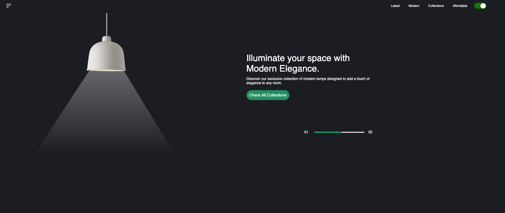
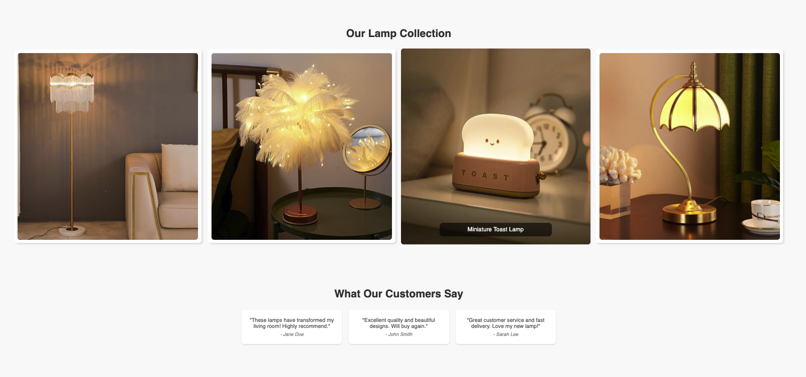

## lampluxe

This project is a responsive website showcasing a modern collection of lamps. It was built for the purpose of mastering various CSS concepts, primarily Flebox, media queries, and responsive design. The website features a hero section, an image gallery with text overlays, a testimonials section, and a modal popup for detailed image viewing. 

### Key Features:
- **Hero Section**: Engaging introduction with a sleek toggle button. 
- **Gallery**: Displays the lamp collection using Flebox. It has hover effects for text overlays and modal popups. 
- **Testimonials**: Customer feedback presented in a visually appealing manner using Flexbox. 
- **Modal Popup**: Provides a close-up view of the gallery images.
- **Responsive Design**: Ensures optimal viewing on various devices (Tabs and Phones) using media queries and Flexbox.

### Technologies Used:
- **HTML5**
- **CSS3**
  - Flexbox
  - Media Queries
- **Vanilla JavaSript**
  - Transitions and Animations

## Design & Layout 
> 
>
> > 
